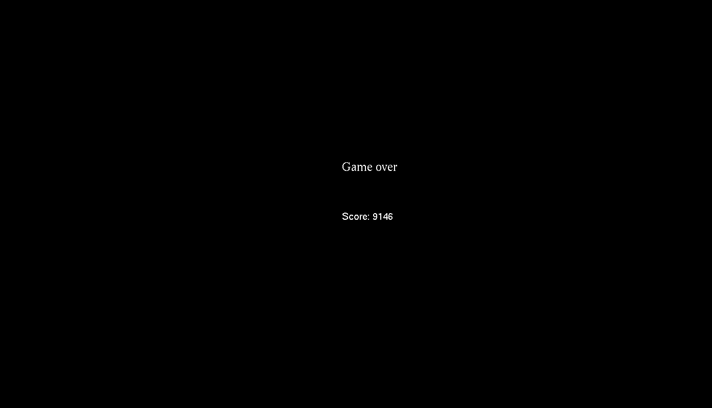
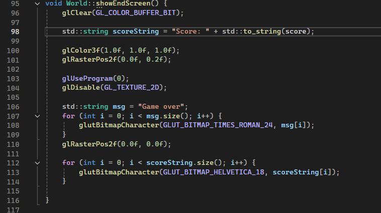

# OpenGL Geometry Dash

## Conceptul proiectului
Geometry Dash implementat cu ajutorul OpenGL

## Transformari utilizate
- rotire (player)
- scalare (player, block)
- translatare (background, player, block)

## Originalitate
- detectarea coliziunilor
- animatie pentru saritura/cadere
- harta infinita 

## Capturi de ecran







## Anexa
### main.cpp
```
#include <windows.h>  // Include libraries
#include <stdlib.h>   // For shader reading
#include <stdio.h>
#include <GL/glew.h>  // GLEW must be included before freeglut
#include <GL/freeglut.h>
#include "loadShaders.h"
#include "base/Shader.h"

#include "World.h"

int previousTime = 0;
const int FPS = 60;
const int frameDelay = 1000 / FPS; // Milliseconds per frame (16.67 ms for 60 FPS)

void TimerFunction(int value)
{
    // Schedule the next frame
    glutPostRedisplay();
    glutTimerFunc(frameDelay, TimerFunction, 0);
}

int main(int argc, char* argv[])
{

    glutInit(&argc, argv);
    glutInitDisplayMode(GLUT_DOUBLE | GLUT_RGB); // Set up a double-buffered display mode
    glutInitWindowPosition(100, 100);            // Initial window position
    glutInitWindowSize(1600, 960);                // Window dimensions
    glutCreateWindow("Grafica pe calculator - primul exemplu"); // Window title
    glewInit();  
    
    World* world = World::getInstance();

    // Set up rendering and cleanup functions
    glutDisplayFunc(World::render);
    //glutCloseFunc(Cleanup);

    glutKeyboardFunc(World::input);

    // Initialize timer function to control frame rate
    glutTimerFunc(frameDelay, TimerFunction, 0);

    glutMainLoop();
}

```
### World.h
```
#pragma once
#include "base/Shader.h"
#include "Texture.h"
#include "Background.h"
#include "Block.h"
#include "CollisionDetector.h"
#include "Player.h"

class World {
private:
	static World* instance;

	int ended = true;
	int score = 0;

	int startTime;
	int previousTime = 0;
	const int width = 80, height = 24;
	const float blockWidth = 2.0 / 40, blockHeight = 2.0 / 24;

	char map[24][80] = {
		"...............................................................................",
		"...............................................................................",
		"...............................................................................",
		"...............................................................................",
		"...............................................................................",
		"...............................................................................",
		"...............................................................................",
		"...............................................................................",
		"...............................................................................",
		"...............................................................................",
		"...............................................................................",
		"...............................................................................",
		".......................xxxxxxx.................................................",
		"..............xxxxxxx..........................................................",
		".......xxxxx...................................................................",
		"xxx........................................................................xxxx",
		"................................................................xxxxxxxx.......",
		"...............................................................................",
		".........................................................x....................",
		"......................xxxx...............................x.....................",
		"................xxxx..xxxx...............................x........x............",
		"........xxxxx...xxxx..xxxx..................x.....................x............",
		"xxxxxxxxxxxxxxxxxxxxxxxxxxxxxxxxxxxxxxxxxxxxxxxxxxxxxxxxxxxxxxxxxxxxxxxxxxxxxxx",
		"...............................................................................",
	};

	Block* blocks[24][80];
	CollisionDetector* collisionDetector;

	float offset = 0;
	float speed = 0.01;


	Shader* playerShader;
	Shader* backgroundShader;
	Shader* blockShader;

	Texture* playerTexture;
	Texture* blockTexture;

	Player* player;
	Background* background;
	
	void loadShaders();

	void loadTextures();

	void createObjects();

	void loadBlocks();

	void renderBlocks();

	void update();

	void initCollisionDetector();

	World();

	void showEndScreen();
public:
	static void render();

	static void input(unsigned char key, int x, int y);

	static World* getInstance();

	float detectCollisionDown();

	float detectCollisionRight();
};
```
### World.cpp
```
#pragma once
#include "base/Shader.h"
#include "Texture.h"
#include "Player.h"
#include "Background.h"
#include "Block.h"
#include "CollisionDetector.h"

#include <ft2build.h>
#include FT_FREETYPE_H  


void World::loadShaders() {
	playerShader = new Shader("player.vert", "player.frag");
	backgroundShader = new Shader("background.vert", "background.frag");
	blockShader = new Shader("block.vert", "block.frag");
}

void World::loadTextures() {
	playerTexture = new Texture("player.jpg");
	blockTexture = new Texture("block.png");
}

void World::createObjects() {
	player = new Player((World*)this, playerShader, playerTexture);
	background = new  Background(backgroundShader);
}

void World::loadBlocks() {
	for (int i = 0; i < height; i++) {
		for (int j = 0; j < width; j++) {
			if (map[i][j] == 'x') {
				blocks[i][j] = new Block(blockShader, blockTexture);
			}
		}
	}
}

void World::renderBlocks() {
	for (int i = 0; i < height; i++) {
		for (int j = 0; j < width; j++) {
			if (map[i][j] == 'x') {
				float x = (j - 20) * blockWidth + offset;
				if (x < -1) {
					x += (width - 1) * blockWidth;
				}
				float y = ((height - i) - 12) * blockHeight;
				blocks[i][j]->setPosition(x, y);
				blocks[i][j]->render();
			}
		}
	}
}

void World::update() {
	int currentTime = glutGet(GLUT_ELAPSED_TIME); // Get current time in milliseconds
	int deltaTime = currentTime - previousTime;
	previousTime = currentTime;

	offset -= speed;
	if (offset < -width * blockWidth) {
		offset += width * blockWidth;
	}

	player->update(deltaTime);
	background->update(deltaTime);

	if (detectCollisionRight() > 1e-5) {
		ended = true;
	}
}

void World::initCollisionDetector() {
	std::vector <Block*> blockArray;
	for (int i = 0; i < height; i++) {
		for (int j = 0; j < width; j++) {
			if (map[i][j] == 'x') {
				blockArray.push_back(blocks[i][j]);
			}
		}
	}
	collisionDetector = new CollisionDetector(player, blockArray);
}

World::World() {
	startTime = glutGet(GLUT_ELAPSED_TIME);
	ended = false;
	loadShaders();
	loadTextures();
	createObjects();
	loadBlocks();
	initCollisionDetector();
}

void World::showEndScreen() {
	glClear(GL_COLOR_BUFFER_BIT);

	std::string scoreString = "Score: " + std::to_string(score);
	
	glColor3f(1.0f, 1.0f, 1.0f);
	glRasterPos2f(0.0f, 0.2f);

	glUseProgram(0);
	glDisable(GL_TEXTURE_2D);

	std::string msg = "Game over";
	for (int i = 0; i < msg.size(); i++) {
		glutBitmapCharacter(GLUT_BITMAP_TIMES_ROMAN_24, msg[i]);
	}
	glRasterPos2f(0.0f, 0.0f);

	for (int i = 0; i < scoreString.size(); i++) {
		glutBitmapCharacter(GLUT_BITMAP_HELVETICA_18, scoreString[i]);
	}

}


void World::render() {
	glClear(GL_COLOR_BUFFER_BIT);

	if (instance->ended == false) {
		instance->update(); 
		instance->background->render();
		instance->player->render(); 
		instance->renderBlocks(); 
		instance->score = glutGet(GLUT_ELAPSED_TIME) - instance->startTime;
	}
	else {

		glColor3f(1.0f, 1.0f, 1.0f); 
		instance->showEndScreen(); 
	}

	glutSwapBuffers(); 
}


void World::input(unsigned char key, int x, int y) {
	switch (key) {
	case ' ': {
		instance->player->jump();
		break;
	}
	}
}

World* World::getInstance() {
	if (instance == nullptr) {
		instance = new World();
	}
	return instance;
}

float World::detectCollisionDown() {
	return collisionDetector->detectDown();
}
float World::detectCollisionRight() {
	return collisionDetector->detectRight();
}

World* World::instance = nullptr;
```
### Background.h
```
#pragma once
#include <GL/glew.h>
#include <GL/freeglut.h>
#include "base/Shader.h"

class Background {
private:
	Shader* shader = nullptr;
	float offset = 0;
	float speed = 0.001;

	float vertices[36] = {
		-1, -1, 0,
		1, -1, 0,
		-1, 1, 0,
		1, 1, 0,

		1, -1, 0,
		3, -1, 0,
		1, 1, 0,
		3, 1, 0,

		3, -1, 0,
		5, -1, 0,
		3, 1, 0,
		5, 1, 0
	};

	float colors[48] = {
		0.1, 0.4, 0.9, 1,
		0.6, 0.2, 0.9, 1,
		0.1, 0.4, 0.9, 1,
		0.6, 0.2, 0.9, 1,
		0.6, 0.2, 0.9, 1,
		0.1, 0.4, 0.9, 1,
		0.6, 0.2, 0.9, 1,
		0.1, 0.4, 0.9, 1,
		0.1, 0.4, 0.9, 1,
		0.6, 0.2, 0.9, 1,
		0.1, 0.4, 0.9, 1,
		0.6, 0.2, 0.9, 1,
	};

	unsigned int VBO_coords;
	unsigned int VBO_color;
	unsigned int VAO;

public:
	Background(Shader* shader);

	void update(int deltaTime);
	void render();
	void freeResources();
};
```
### Background.cpp
```
#include "Background.h"
#include <iostream>

Background::Background(Shader* shader){
	this->shader = shader;

	glGenVertexArrays(1, &VAO);
	glBindVertexArray(VAO);


	glGenBuffers(1, &VBO_coords);
	glBindBuffer(GL_ARRAY_BUFFER, VBO_coords);
	glBufferData(GL_ARRAY_BUFFER, sizeof(vertices), vertices, GL_STATIC_DRAW);

	glVertexAttribPointer(0, 3, GL_FLOAT, GL_FALSE, 3 * sizeof(float), (void*)0);
	glEnableVertexAttribArray(0);

	glGenBuffers(1, &VBO_color);
	glBindBuffer(GL_ARRAY_BUFFER, VBO_color);
	glBufferData(GL_ARRAY_BUFFER, sizeof(colors), colors, GL_STATIC_DRAW);

	glVertexAttribPointer(1, 4, GL_FLOAT, GL_FALSE, 4 * sizeof(float), (void*)0);
	glEnableVertexAttribArray(1);
}

void Background::update(int deltaTime) {
	offset -= deltaTime * speed;
	if (offset < -4) {
		offset += 4;
	}
}

void Background::render(){
	shader->use();
	shader->setFloat("xOffset", offset);

	glBindVertexArray(this->VAO);
	glDrawArrays(GL_TRIANGLES, 0, 3);
	glDrawArrays(GL_TRIANGLES, 1, 3);
	glDrawArrays(GL_TRIANGLES, 4, 3);
	glDrawArrays(GL_TRIANGLES, 5, 3);
	glDrawArrays(GL_TRIANGLES, 8, 3);
	glDrawArrays(GL_TRIANGLES, 9, 3);
}

void Background::freeResources(){
	glDeleteVertexArrays(1, &VAO);
	glDeleteBuffers(1, &VBO_coords);
	glDeleteBuffers(1, &VBO_color);
}

```
### background.vert
```
#version 330 core

layout (location = 0) in vec3 position;
layout (location = 1) in vec4 _color;

uniform float xOffset;

out vec4 color;

void main()
{
    gl_Position = vec4(position.x + xOffset, position.y, position.z, 1.0);
    color = _color;
}
```
### background.frag
#version 330 core

in vec4 color;
out vec4 out_Color;

void main(void)
  {
    out_Color = color;
  }
### Texture.h
```
#pragma once
#include <GL/glew.h>
#include <GL/freeglut.h>
#include "SOIL.h"
#include <string>

class Texture {

private:
	unsigned int id;

public:
	Texture(std::string path);
	void use();
	void freeResources();
};
```
### Texture.cpp
```
#include "Texture.h"

Texture::Texture(std::string path)
{
    glGenTextures(1, &id);
    glBindTexture(GL_TEXTURE_2D, id); // all upcoming GL_TEXTURE_2D operations now have effect on this texture object
    // set the texture wrapping parameters
    glTexParameteri(GL_TEXTURE_2D, GL_TEXTURE_WRAP_S, GL_REPEAT);	// set texture wrapping to GL_REPEAT (default wrapping method)
    glTexParameteri(GL_TEXTURE_2D, GL_TEXTURE_WRAP_T, GL_REPEAT);
    // set texture filtering parameters
    glTexParameteri(GL_TEXTURE_2D, GL_TEXTURE_MIN_FILTER, GL_LINEAR_MIPMAP_LINEAR);
    glTexParameteri(GL_TEXTURE_2D, GL_TEXTURE_MAG_FILTER, GL_LINEAR);

    int width, height;
    unsigned char* image = SOIL_load_image(path.c_str(), &width, &height, 0, SOIL_LOAD_RGB);
    glTexImage2D(GL_TEXTURE_2D, 0, GL_RGB, width, height, 0, GL_RGB, GL_UNSIGNED_BYTE, image);
    glGenerateMipmap(GL_TEXTURE_2D);

    // Eliberarea resurselor
    SOIL_free_image_data(image);
    glBindTexture(GL_TEXTURE_2D, 0);
}

void Texture::use() {
    glActiveTexture(GL_TEXTURE0);
    glBindTexture(GL_TEXTURE_2D, id);
    //glUniform1i(glGetUniformLocation(ProgramId, "myTexture"), 0);
}

void Texture::freeResources()
{
    glDisableVertexAttribArray(2);
}

```
### Shader.h
```
#ifndef SHADER_H
#define SHADER_H

#include <GL/glew.h>
#include <GL/freeglut.h>
#include "glm/glm.hpp"	
#include "glm/gtc/matrix_transform.hpp"
#include "glm/gtx/transform.hpp"
#include "glm/gtc/type_ptr.hpp"

#include <string>
#include <fstream>
#include <sstream>
#include <iostream>


class Shader {
private:
    // the program ID
    unsigned int ID;
public:
    // constructor reads and builds the shader
    Shader(const char* vertexPath, const char* fragmentPath);
    // use/activate the shader
    void use();
    // remove the shader
    void remove();
    // utility uniform functions
    void setBool(const std::string& name, bool value) const;
    void setInt(const std::string& name, int value) const;
    void setFloat(const std::string& name, float value) const;
    void setMat4(const std::string& name, glm::mat4& value) const;
};

#endif
```
### Shader.cpp
```
#include "base/Shader.h"

Shader::Shader(const char* vertexPath, const char* fragmentPath)
{
    // 1. retrieve the vertex/fragment source code from filePath
    std::string vertexCode;
    std::string fragmentCode;
    std::ifstream vShaderFile;
    std::ifstream fShaderFile;
    // ensure ifstream objects can throw exceptions:
    vShaderFile.exceptions(std::ifstream::failbit | std::ifstream::badbit);
    fShaderFile.exceptions(std::ifstream::failbit | std::ifstream::badbit);
    try
    {
        // open files
        vShaderFile.open(vertexPath);
        fShaderFile.open(fragmentPath);
        std::stringstream vShaderStream, fShaderStream;
        // read file's buffer contents into streams
        vShaderStream << vShaderFile.rdbuf();
        fShaderStream << fShaderFile.rdbuf();
        // close file handlers
        vShaderFile.close();
        fShaderFile.close();
        // convert stream into string
        vertexCode = vShaderStream.str();
        fragmentCode = fShaderStream.str();
    }
    catch (std::ifstream::failure e)
    {
        std::cout << "ERROR::SHADER::FILE_NOT_SUCCESFULLY_READ" << std::endl;
    }
    const char* vShaderCode = vertexCode.c_str();
    const char* fShaderCode = fragmentCode.c_str();

    // 2. compile shaders
    unsigned int vertex, fragment;
    int success;
    char infoLog[512];

    // vertex Shader
    vertex = glCreateShader(GL_VERTEX_SHADER);
    glShaderSource(vertex, 1, &vShaderCode, NULL);
    glCompileShader(vertex);
    // print compile errors if any
    glGetShaderiv(vertex, GL_COMPILE_STATUS, &success);
    if (!success)
    {
        glGetShaderInfoLog(vertex, 512, NULL, infoLog);
        std::cout << "ERROR::SHADER::VERTEX::COMPILATION_FAILED\n" << infoLog << std::endl;
    };

    // fragment Shader
    fragment = glCreateShader(GL_FRAGMENT_SHADER);
    glShaderSource(fragment, 1, &fShaderCode, NULL);
    glCompileShader(fragment);
    // print compile errors if any
    glGetShaderiv(fragment, GL_COMPILE_STATUS, &success);
    if (!success)
    {
        glGetShaderInfoLog(fragment, 512, NULL, infoLog);
        std::cout << "ERROR::SHADER::FRAGMENT::COMPILATION_FAILED\n" << infoLog << std::endl;
    };

    // shader Program
    ID = glCreateProgram();
    glAttachShader(ID, vertex);
    glAttachShader(ID, fragment);
    glLinkProgram(ID);
    // print linking errors if any
    glGetProgramiv(ID, GL_LINK_STATUS, &success);
    if (!success)
    {
        glGetProgramInfoLog(ID, 512, NULL, infoLog);
        std::cout << "ERROR::SHADER::PROGRAM::LINKING_FAILED\n" << infoLog << std::endl;
    }

    // delete the shaders as they're linked into our program now and no longer necessary
    glDeleteShader(vertex);
    glDeleteShader(fragment);
};

void Shader::use()
{
    glUseProgram(ID);
}

void Shader::remove() {
    glDeleteProgram(this->ID);
}

void Shader::setBool(const std::string& name, bool value) const
{
    glUniform1i(glGetUniformLocation(ID, name.c_str()), (int)value);
}
void Shader::setInt(const std::string& name, int value) const
{
    glUniform1i(glGetUniformLocation(ID, name.c_str()), value);
}
void Shader::setFloat(const std::string& name, float value) const
{
    glUniform1f(glGetUniformLocation(ID, name.c_str()), value);
}

void Shader::setMat4(const std::string& name, glm::mat4& value) const
{
    glUniformMatrix4fv(glGetUniformLocation(ID, name.c_str()), 1, GL_FALSE, &value[0][0]);
}

```
### Player.h
```
#pragma once

#include <GL/glew.h>
#include <GL/freeglut.h>
#include "base/Shader.h"
#include "Texture.h"
#include <string>
#include <vector>
#include "CollisionDetector.h"
#include "Collision.h"
#include "World.h"

class World;

class Player {
private:
	const std::string scaleMatrixTag = "scaleMatrix";
	const std::string translateMatrixTag = "translateMatrix";
	const std::string rotationMatrixTag = "rotationMatrix";
	
	World* world = nullptr;
	Shader* shader = nullptr;
	Texture* texture = nullptr;

	float xPosition = 0, yPosition = 0;
	float height = 2.0/24, width = 2.0/40;

	bool isInAir = true;
	float gravitationalAcceleration = 10, yVelocity = 0;
	float rotationAngle = 0, rotationSpeed = 0;

	float vertices[20] = {
		-0.5, -0.5, 0, 0, 1,
		0.5, -0.5, 0, 1, 1,
		0.5, 0.5, 0, 1, 0,
		-0.5, 0.5, 0, 0, 0,
	};

	unsigned int VBO;
	unsigned int VAO;

	float closestValue(float value, std::vector <float> set);

public:

	Player(World* world, Shader* shader, Texture* texture);

	void render();
	void freeResources();
	void update(int deltaTime);
	void jump();

	float getWidth() const;
	float getHeight() const;
	float getXPosition() const;
	float getYPosition() const;
};


```
### Player.cpp
```
#include <GL/glew.h>
#include <GL/freeglut.h>
#include "base/Shader.h"
#include "Player.h"
#include "World.h"

# define M_PI  3.14159265358979323846


float Player::closestValue(float value, std::vector<float> set)
{
	float minDiff = 1e10;
	float closestValue = value;
	for (float s : set) {
		float diff = std::abs(s - value);
		if (minDiff > diff) {
			minDiff = diff;
			closestValue = s;
		}
	}
	return closestValue;
}

Player::Player(World* world, Shader* shader, Texture* texture) {
	this->world = world;
	this->shader = shader;
	this->texture = texture;

	glGenVertexArrays(1, &VAO);
	glBindVertexArray(VAO);
		

	glGenBuffers(1, &VBO);
	glBindBuffer(GL_ARRAY_BUFFER, VBO);
	glBufferData(GL_ARRAY_BUFFER, sizeof(vertices), vertices, GL_STATIC_DRAW);

	glVertexAttribPointer(0, 3, GL_FLOAT, GL_FALSE, 5 * sizeof(float), (void*)0);
	glEnableVertexAttribArray(0);


	glVertexAttribPointer(1, 2, GL_FLOAT, GL_FALSE, 5 * sizeof(float), (void*)(3 * sizeof(float)));
	glEnableVertexAttribArray(1);
}

void Player::render() {
	shader->use();
	glm::mat4 scaleMatrix = glm::scale(glm::mat4(1.0f), glm::vec3(width, height, 1.0));
	shader->setMat4(scaleMatrixTag,scaleMatrix);
	glm::mat4 translateMatrix = glm::translate(glm::mat4(1), glm::vec3(xPosition, yPosition, 0));
	shader->setMat4(translateMatrixTag, translateMatrix);
	glm::mat4 rotationMatrix = glm::rotate(glm::mat4(1), rotationAngle, glm::vec3(0, 0, 1));
	shader->setMat4(rotationMatrixTag, rotationMatrix);

	texture->use();
	glBindVertexArray(this->VAO);
	glDrawArrays(GL_TRIANGLE_FAN, 0, 4);
}

void Player::freeResources() {
	glDeleteVertexArrays(1, &VAO);
	glDeleteBuffers(1, &VBO);
}

void Player::update(int deltaTime)
{
	float collision = world->detectCollisionDown();

	if (collision > 1e-7) {
		while (rotationAngle >= 2 * M_PI) {
			rotationAngle -= 2 * M_PI;
		}
		while (rotationAngle < 0) {
			rotationAngle += 2 * M_PI;
		}

		yPosition += collision;

		rotationAngle = closestValue(rotationAngle, { 0, M_PI / 2, M_PI, 3 * M_PI / 2, 2 * M_PI });

		yVelocity = 0;
		isInAir = false;
	}
	else if(isInAir){
		rotationAngle += rotationSpeed * deltaTime / 1000.0;

		yPosition += yVelocity * deltaTime / 1000.0;
		yVelocity -= gravitationalAcceleration * deltaTime / 1000.0;
	}
	else if (collision < 0) {
		isInAir = true;
	}
}


void Player::jump()
{
	if (!isInAir) {
		yVelocity = 2;
		rotationSpeed = -0.98 * M_PI / (2 * yVelocity / gravitationalAcceleration);
		isInAir = true;
	}
}

float Player::getWidth() const
{
	return width;
}

float Player::getHeight() const
{
	return height;
}

float Player::getXPosition() const
{
	return xPosition;
}

float Player::getYPosition() const
{
	return yPosition;
}

```
### player.vert
```
#version 330 core
layout (location = 0) in vec3 aPos;
layout (location = 1) in vec2 aTexCoord;

out vec3 ourColor;
out vec2 TexCoord;

uniform mat4 scaleMatrix;
uniform mat4 translateMatrix;
uniform mat4 rotationMatrix;

void main()
{
    gl_Position = translateMatrix * scaleMatrix * rotationMatrix * vec4(aPos, 1.0);
    TexCoord = aTexCoord;
}
```
### player.frag
```
#version 330 core
  
in vec3 ourColor;
in vec2 TexCoord;

out vec4 FragColor;

uniform sampler2D ourTexture;

void main()
{
    FragColor = texture(ourTexture, TexCoord);
}
```
### Block.h
```
#pragma once
#include <GL/glew.h>
#include <GL/freeglut.h>
#include "base/Shader.h"
#include "Texture.h"

class Block {
private:
	const std::string scaleMatrixTag = "scaleMatrix";
	const std::string translateMatrixTag = "translateMatrix";

	Shader* shader = nullptr;
	Texture* texture = nullptr;
	float speed = 0.001;

	float vertices[36] = {
		-0.5, -0.5, 0, 0, 1,
		0.5, -0.5, 0, 1, 1,
		0.5, 0.5, 0, 1, 0,
		-0.5, 0.5, 0, 0, 0,
	};

	float xPosition = 0, yPosition = 0;
	float height = 2.0 / 24, width = 2.0 / 40;

	unsigned int VBO;
	unsigned int VAO;

public:
	Block(Shader* shader, Texture* texture);

	void setPosition(float x, float y);
	void render();
	void freeResources();

	float getWidth() const;
	float getHeight() const;
	float getXPosition() const;
	float getYPosition() const;
};
```
### Block.cpp
```
#include "Block.h"

Block::Block(Shader* shader, Texture* texture)
{
	this->shader = shader;
	this->texture = texture;

	glGenVertexArrays(1, &VAO);
	glBindVertexArray(VAO);


	glGenBuffers(1, &VBO);
	glBindBuffer(GL_ARRAY_BUFFER, VBO);
	glBufferData(GL_ARRAY_BUFFER, sizeof(vertices), vertices, GL_STATIC_DRAW);

	glVertexAttribPointer(0, 3, GL_FLOAT, GL_FALSE, 5 * sizeof(float), (void*)0);
	glEnableVertexAttribArray(0);


	glVertexAttribPointer(1, 2, GL_FLOAT, GL_FALSE, 5 * sizeof(float), (void*)(3 * sizeof(float)));
	glEnableVertexAttribArray(1);
}

void Block::setPosition(float x, float y)
{
	xPosition = x;
	yPosition = y;
}

void Block::render()
{
	shader->use();
	glm::mat4 scaleMatrix = glm::scale(glm::mat4(1.0f), glm::vec3(width, height, 1.0));
	shader->setMat4(scaleMatrixTag, scaleMatrix);
	glm::mat4 translateMatrix = glm::translate(glm::mat4(1), glm::vec3(xPosition, yPosition, 0));
	shader->setMat4(translateMatrixTag, translateMatrix);

	texture->use();
	glBindVertexArray(this->VAO);
	glDrawArrays(GL_TRIANGLE_FAN, 0, 4);
}

void Block::freeResources()
{
	glDeleteVertexArrays(1, &VAO);
	glDeleteBuffers(1, &VBO);
}

float Block::getWidth() const
{
	return width;
}

float Block::getHeight() const
{
	return height;
}

float Block::getXPosition() const
{
	return xPosition;
}

float Block::getYPosition() const
{
	return yPosition;
}

```
### CollisionDetector.h
```
#pragma once
#include "Block.h"
#include "Player.h"
#include "Collision.h"
#include <vector>

class Player;

class CollisionDetector {
private:
	std::vector <Block*> blocks;
	Player* player = nullptr;
public:

	CollisionDetector(Player* player, std::vector <Block*> blocks);

	float detectDown();
	float detectRight();
	//Collision detectRight();
};


```
### CollisionDetector.cpp
```
#pragma once
#include "Block.h"
#include "Player.h"
#include "Collision.h"
#include <vector>

#include <iostream>

CollisionDetector::CollisionDetector(Player* player, std::vector <Block*> blocks) {
	this->player = player;
	this->blocks = blocks;
}


float CollisionDetector::detectDown() {
	float xPlayer = player->getXPosition();
	float yPlayer = player->getYPosition();
	float playerWidth = player->getWidth();
	float playerHeight = player->getHeight();

	for (const auto& block : blocks) {
		float xBlock = block->getXPosition();
		float yBlock = block->getYPosition();
		float blockWidth = block->getWidth();
		float blockHeight = block->getHeight();

		float xOverlap = -(std::abs(xPlayer - xBlock) - (playerWidth + blockWidth) / 2);
		float yOverlap = -(std::abs(yPlayer - yBlock) - (playerHeight + blockHeight) / 2);

		if (xOverlap > 0 && yOverlap > 0) {
			if (yPlayer > yBlock && std::abs(yPlayer - yBlock) > std::abs(xPlayer - xBlock)) {
				
				return yOverlap; 
			}

		}
	}
	return -1;
}

float CollisionDetector::detectRight() {
	float xPlayer = player->getXPosition();
	float yPlayer = player->getYPosition();
	float playerWidth = player->getWidth();
	float playerHeight = player->getHeight();

	for (const auto& block : blocks) {
		float xBlock = block->getXPosition();
		float yBlock = block->getYPosition();
		float blockWidth = block->getWidth();
		float blockHeight = block->getHeight();

		float xOverlap = -(std::abs(xPlayer - xBlock) - (playerWidth + blockWidth) / 2);
		float yOverlap = -(std::abs(yPlayer - yBlock) - (playerHeight + blockHeight) / 2);

		if (xOverlap > 0 && yOverlap > 0) {
			if (xPlayer > xBlock && std::abs(yPlayer - yBlock) < std::abs(xPlayer - xBlock)) {

				return yOverlap;
			}

		}
	}
	return -1;
}


```

